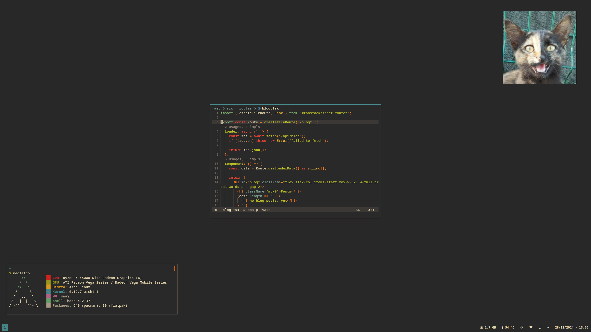

# My personal dotfiles
## Screenshot


## List of Packages
found in the arch.txt file, can be installed by executing `install.sh ` which is generated by executing `update_install.sh`, needs `paru`

## How to deploy ?
```bash
cd .dotfiles
cd stowable
stow * --target=/home/<your_username>
```
